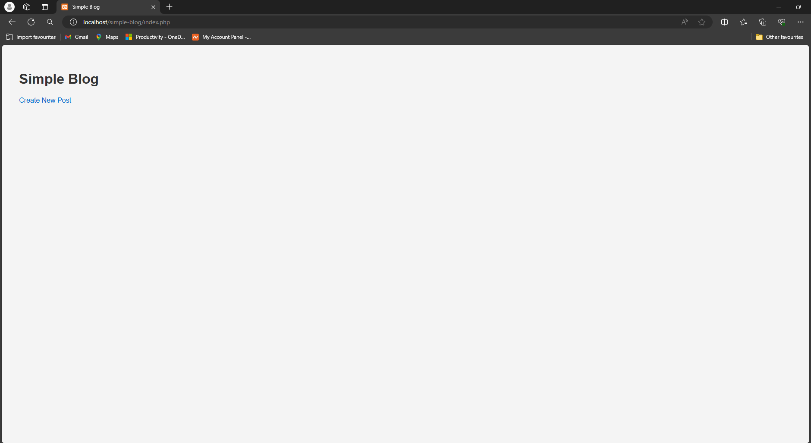
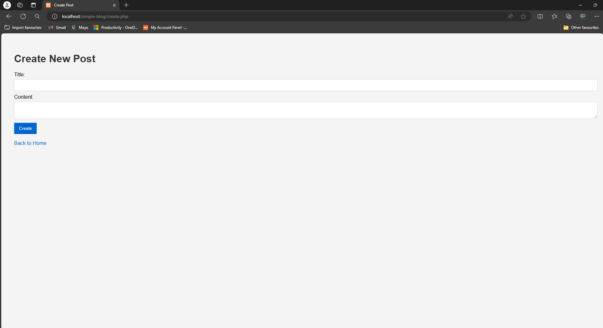
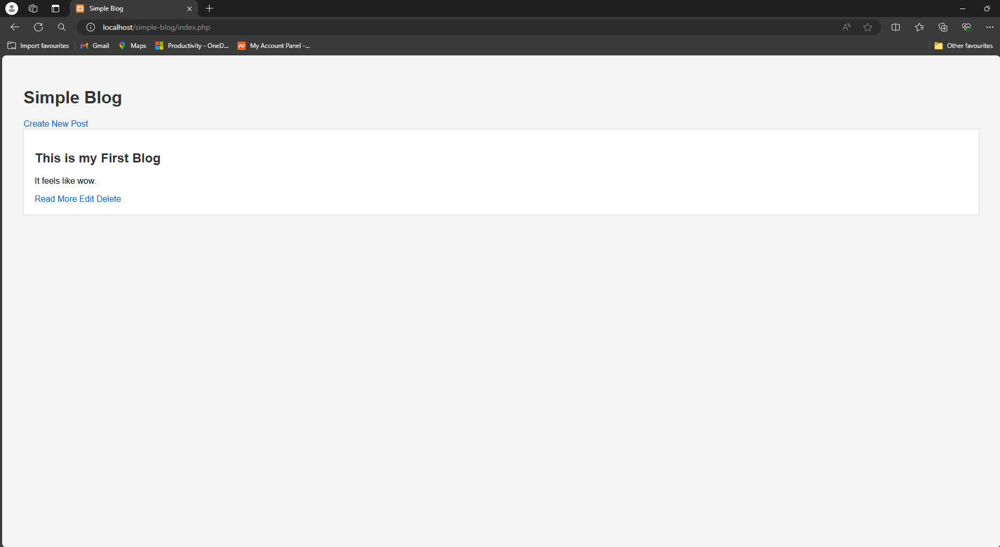

# Simple Blog Application

A basic blog application built with PHP and MySQL. This project demonstrates fundamental web development skills, including CRUD operations, database interaction, and basic front-end styling.

## Features

- Create, read, update, and delete blog posts.
- Simple and clean user interface.
- Uses PDO for secure database interactions.

## Installation

Follow these steps to get a copy of the project up and running on your local machine for development and testing purposes.

### Prerequisites

- PHP 7.4 or higher
- MySQL
- A web server (e.g., Apache, Nginx)
- Composer (optional for dependency management)

### Setup

1. **Clone the repository:**
    ```bash
    git clone https://github.com/spacewithme/Simple-Blog.git
    cd Simple-Blog
    ```

2. **Create the database and table:**

    Use the following SQL script to set up your database and table:
    ```sql
    CREATE DATABASE blog;
    USE blog;

    CREATE TABLE posts (
        id INT AUTO_INCREMENT PRIMARY KEY,
        title VARCHAR(255) NOT NULL,
        content TEXT NOT NULL
    );
    ```

3. **Configure the database connection:**

    Update the `config.php` file with your database credentials:
    ```php
    <?php
    $host = 'localhost';
    $db = 'blog';
    $user = 'root';
    $pass = '';

    try {
        $pdo = new PDO("mysql:host=$host;dbname=$db", $user, $pass);
        $pdo->setAttribute(PDO::ATTR_ERRMODE, PDO::ERRMODE_EXCEPTION);
    } catch (PDOException $e) {
        die("Could not connect to the database: " . $e->getMessage());
    }
    ?>
    ```

4. **Run the application:**

    Place the project in your web server's root directory or configure a virtual host. Open your web browser and navigate to the project directory (e.g., `http://localhost/Simple-Blog`).

## Usage

- **Home Page:**
  Displays a list of all blog posts with options to read more, edit, or delete each post.

- **Create Post:**
  Navigate to the "Create New Post" link to add a new blog post.

- **Edit Post:**
  Click the "Edit" link on a post to modify its title or content.

- **Delete Post:**
  Click the "Delete" link on a post to remove it from the database.

## Screenshots

### Home Page


### Create Post


### Edit Post


## Contributing

Feel free to fork this repository and contribute by submitting a pull request. For major changes, please open an issue first to discuss what you would like to change.

## License

This project is licensed under the MIT License - see the [LICENSE](LICENSE) file for details.

## Acknowledgments

- Thanks to the PHP and MySQL communities for providing extensive documentation and support.
- Inspired by various simple blog tutorials and examples available online.

---
